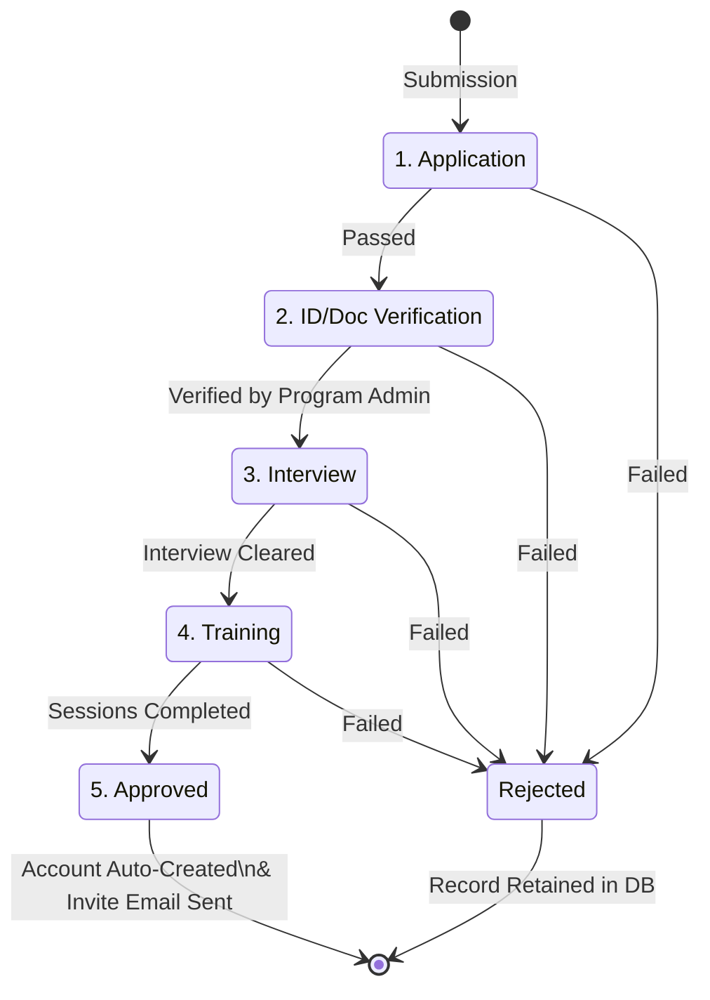
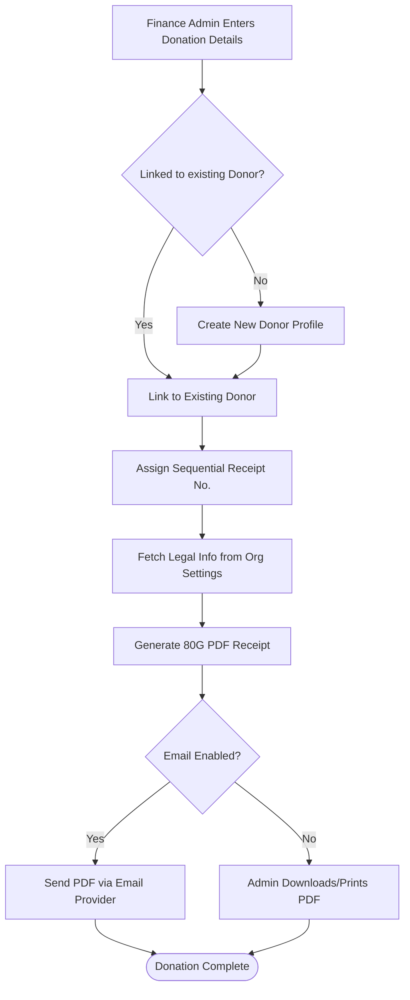
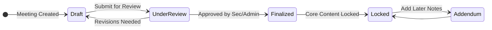
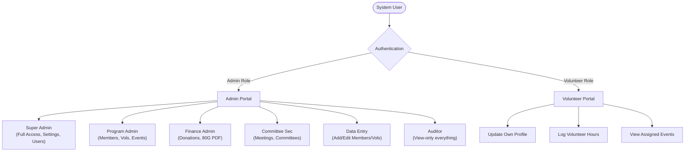

# FMF Management System Workflows

This document outlines the core workflows within the FMF Trust Management System based on the project requirements.

## 1. Volunteer Registration & Onboarding Pipeline

The volunteer onboarding process is a multi-step pipeline. A candidate must pass through 5 stages to gain access to the Volunteer Portal. They can be rejected at any stage (with a reason logged), and the record is retained for audit purposes.

## 2. Donation & 80G Receipt Generation Flow

When the Finance Admin enters a donation, the system handles receipt numbering and PDF generation automatically by pulling dynamic data from the Organization Settings.

## 3. Meeting Minutes Lifecycle

Meeting minutes undergo a strict state lifecycle to ensure governance and integrity. Once finalized, the core minutes cannot be altered.

## 4. User Access & Role Distribution Workflow

The system is split between two portals. Based on authentication and role, users are routed to their respective areas and restricted to specific modules.

